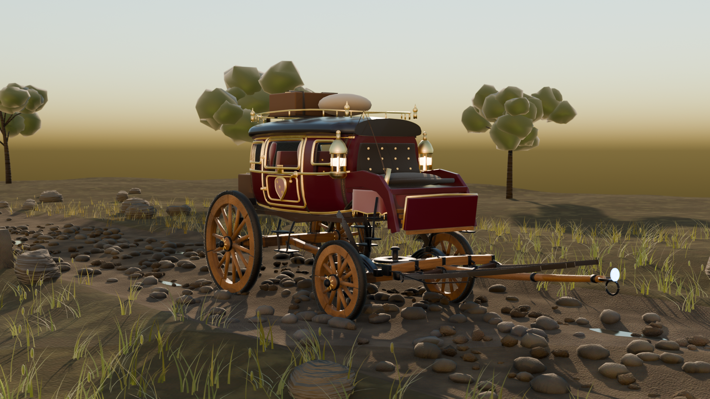
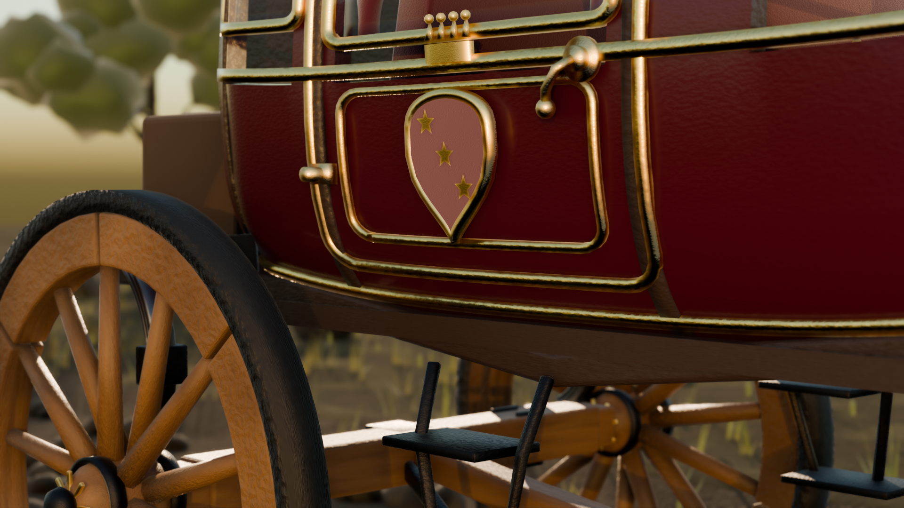
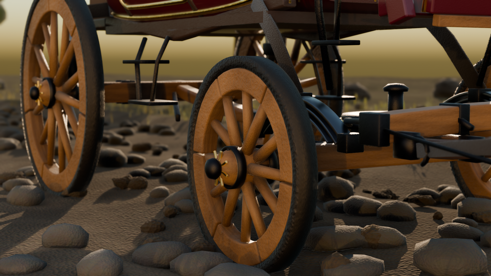
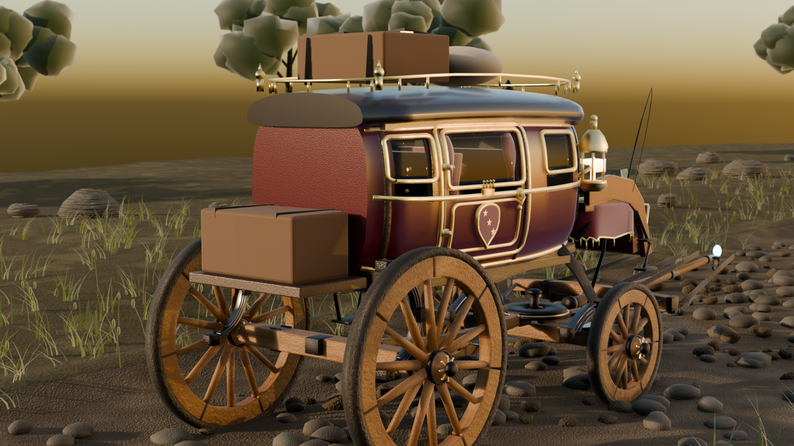
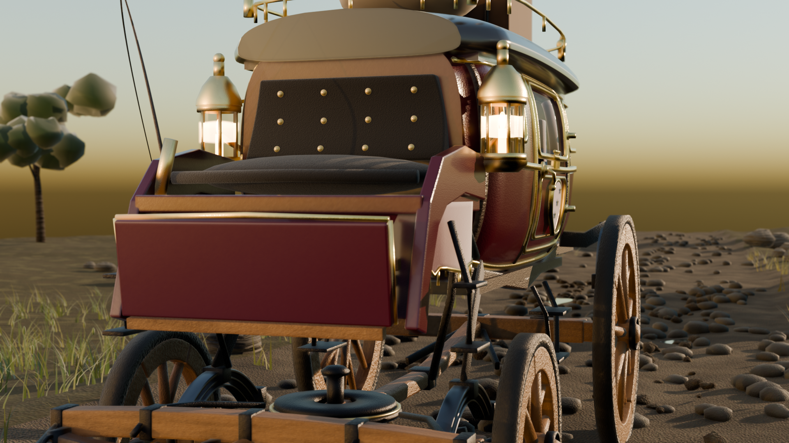

# A fantasy carriage, built by an AI agent inside a live Blender session

Every vertex in this scene was written by Python pushed into a **running** Blender 4.3 instance
over a socket, while the viewport updated on screen. No mouse, no keyboard, no sculpting, no asset
packs, no imported meshes, no image textures. The build was screen-recorded from inside Blender
itself.

The agent was [Claude Code](https://claude.com/claude-code) (Opus 5). The build took about
40 minutes of wall-clock time.



| | |
|---|---|
|  |  |
|  |  |

**[`carriage_build.mp4`](carriage_build.mp4)** — the recording. ~40 s of sped-up build, then a
~19 s cinematic fly-through over the hub, springs, door crest, lantern, roof and pole. No audio.

---

## How the control actually worked

This is the part people find hard to believe, so it is worth being precise.

The agent did **not** drive the GUI, and did **not** run `blender --background`. A small add-on
inside the already-open Blender instance listens on a TCP socket (`127.0.0.1:9876`) and accepts
newline-delimited JSON:

```json
{"id": "a1b2", "command": "python.execute",
 "params": {"code": "import bpy\n...", "timeout_seconds": 300}}
```

The add-on drains that queue from a `bpy.app.timers` callback, so submitted code runs on Blender's
**main thread**. That is why the viewport visibly redraws as geometry appears — it is one live
session, not a render farm.

The entire client is [`scripts/bl.py`](scripts/bl.py) — about 40 lines of socket plus JSON. Every
stage script in `scripts/` was pushed through it and executed in-process.

### The bridge add-on is not included here

The add-on used was already installed on the machine and is not mine to redistribute. Anything
that speaks the protocol above will work. The public project with the same idea is
**[BlenderMCP](https://github.com/ahujasid/blender-mcp)** (MIT, 24k+ stars), though its command
set differs — it uses `get_scene_info` / `execute_code`, while this bridge used `scene.get_info`,
`python.execute`, `python.execute_async` plus a job queue for long renders.

Writing your own is a weekend's work: bind a socket, push requests onto a queue, drain the queue
in a `bpy.app.timers` callback, `exec()` the code, send the result back as JSON.

## How the recording worked

There is no ffmpeg binary on that machine and no external capture tool was used.

- [`scripts/start_rec.py`](scripts/start_rec.py) registers a `bpy.app.timers` callback that fires
  every 0.55 s and calls `bpy.ops.screen.screenshot()`. Blender screenshots **its own window**, so
  nothing else on the desktop is ever captured and window occlusion does not matter.
- [`scripts/encode.py`](scripts/encode.py) assembles the frames as an image strip in Blender's own
  Video Sequence Editor and encodes H.264 through the FFmpeg that ships inside Blender.

A first attempt used desktop-region capture and grabbed unrelated windows; those frames were
deleted and the approach was replaced with the above.

## What is in the model

~120 objects. Every material is procedural — there is not a single image texture in the file.

- **Wheels** — segmented felloes, iron tyre with nails, 14/12 dished tapered spokes, banded hub
  with a gilded star. Front wheels are smaller than rear, as on a real coach.
- **Running gear** — timber axle trees with iron arms and linchpins, fifth-wheel turntable with a
  brass wear ring and king pin, perch, futchells, rear C-springs and front semi-elliptic springs
  (three leaves each), leather suspension braces.
- **Body** — a superellipse cross-section lofted along 60 stations with tumblehome; window
  openings are cut out of the loft and closed by a solidify rim; gold mouldings are swept along
  the curved surface using per-point surface frames; armorial shield with a coronet, brass door
  furniture, folding step.
- **Top and box** — crowned roof with balustrade and finials, strapped trunk, coachman's box with
  hammercloth and bullion fringe, two brass lanterns with live flame, whip.
- **Harness** — splinter bar, pole with iron ferrules and a warding gem, swingletrees, traces,
  chains. No horses.
- **Scene** — road with wheel ruts, cobbles, puddles and clods; grass, weeds, boulders, trees,
  milestone, signpost. Golden-hour backlight, EEVEE Next.

## Running the scripts yourself

1. Blender 4.3 with a bridge add-on listening on `127.0.0.1:9876`.
2. Each script has an absolute path constant near the top, left as a placeholder:
   `C:\path\to\blender-live-agent-build\scripts`. Point it at your checkout.
3. Push them in order:

```bash
python scripts/bl.py exec scripts/s1_scene.py
python scripts/bl.py exec scripts/s2_materials.py
# ... and so on
```

### Order

```
lib.py                    shared procedural helpers (bmesh, sweeps, lofts, revolves, materials)
bl.py                     the socket client
start_rec.py              begin the in-Blender timelapse
s1_scene.py               wipe scene, sky, sun, camera, EEVEE settings
s2_materials.py           29 procedural materials
s3_road.py  s3b  s3c      terrain, road bed with ruts, cobbles, ground shaders
s4_wheels.py              four built-up wheels
s5_terrain_level.py       level the road's longitudinal profile, reseat the wheels on it
s6_undercarriage.py  s6b  axles, springs, perch, turntable
s7_body.py  s7b  s7c      body shell, window cut-outs, gold mouldings
s8_roof_box.py  s8b  s8c  roof, coachman's box, rear platform
s9_details.py             glazing, interior, lanterns, door furniture, crest, steps
s10_pole.py               splinter bar, pole, swingletrees, traces, whip
s11_env.py                grass, boulders, trees, signpost, milestone, puddles
s12_trees_light.py        distant trees, golden-hour backlight
s13_finish.py             road dressing, weeds
s14_polish.py             emissive levels, foreground cleanup
s15_fix_emitters.py       rebuild flames and gem after a stray object scale
s17_crest.py              heraldic shield
s19_handle.py             door handle moved clear of the crest
fix_scale.py              undo an accidental scene-wide scale (see below)
flythrough.py             the 10-pose camera move
encode.py                 assemble the final MP4 in Blender's VSE
s16/s18_finals2.py        the still renders
```

The `b`/`c` suffixes are honest, not tidy. The first body came out as a barrel, the turntable as a
giant torus with a 1.46 m radius, and the coachman's box side panels were extruded along the wrong
axis and became horizontal slabs. Each was diagnosed from a render and rebuilt.

## The scale accident

Mid-build, every object in the scene — including the camera — suddenly carried a scale of
**4.79482**, and renders came back as an extreme close-up of a wheel. Someone had selected all and
scaled in the viewport of the same live session the agent was working in.

[`fix_scale.py`](scripts/fix_scale.py) solves for the pivot from a known object's location
(`P = loc / (1 - s)` for anything authored at the origin), then inverts the transform on all 80
affected objects.

That moment is visible in the recording. It is also the single best piece of evidence that this was
a real interactive session rather than a headless render: a background process cannot be
accidentally interfered with by a human hand.

## Files

| path | what |
|---|---|
| `carriage_build.mp4` | the recording, 1280×720, no audio |
| `fantasy_carriage.blend` | the finished scene — open it, nothing is baked |
| `renders/` | five stills, 1920×1080, EEVEE Next, 224 samples |
| `scripts/` | every script pushed through the bridge, in build order (~4000 lines) |

## Licence

MIT — see [LICENSE](LICENSE).
